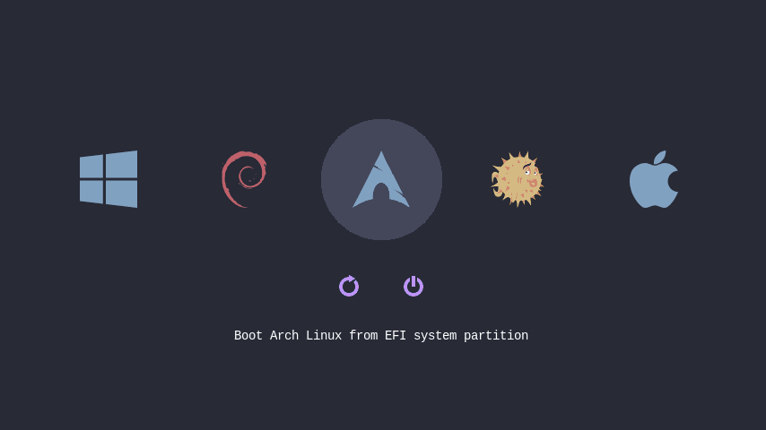

# rEFInd theme Dracula
[](https://github.com/rassweiler/refind-theme-dracula.git/actions/workflows/test.yml)
[](https://github.com/rassweiler/refind-theme-dracula.git/blob/master/LICENSE) [](https://aur.archlinux.org/packages/refind-theme-dracula/)

Simple [rEFInd](http://www.rodsbooks.com/refind/) theme inspired by the [Dracula](https://draculatheme.com) palette.



This theme is derived from icons from other source; see [COPYING](https://github.com/rassweiler/refind-theme-dracula.git/blob/master/COPYING) for details.

## Installation

On UNIX-like platforms simply open a terminal and enter:

```bash
curl -sL https://raw.githubusercontent.com/rassweiler/refind-theme-dracula/master/install.sh | bash
```


Or if you prefer to install manually:

1. Download lastest release
	```bash
	curl -sL https://github.com/rassweiler/refind-theme-dracula.git/releases/download/1.0.0/refind-theme-dracula-1.0.0.tar.gz | tar xvz
	```
	```bash
	cd refind-theme-dracula-1.0.0
	```
2. Identify your `EFI` partition and inside it your `refind` directory. For example: `/efi/EFI/refind`
	```bash
	tree -L 3 /efi	
	```
	It results in:
	```bash
	/efi
	└── EFI
		└── refind
			├── fonts
			├── icons
			├── refind.conf
			├── refind_x64.efi
			└── vars
	```
  
3. Create the directory `/efi/EFI/refind/themes/dracula` and copy files to it. You need root permissions
	```bash
	sudo mkdir -p /efi/EFI/refind/themes/dracula
	```

	```bash
	sudo cp -r {icons,theme.conf,*.png} $_
	```

4. Includes Dracula theme in `/efi/EFI/refind/refind.conf`
	```bash
	sudo sed "s/^include/#include/g" -i /efi/EFI/refind/refind.conf
	```

	```bash
	echo "include themes/dracula/theme.conf" | sudo tee -a /efi/EFI/refind/refind.conf
	```

## Installation on Arch Linux

From AUR repository:
```bash
git clone https://aur.archlinux.org/refind-theme-dracula.git
cd refind-theme-dracula
makepkg -si
```

Using AUR helper as PARU:
```bash
paru -S refind-theme-dracula
```

### TODO

- [ ] Add [Dracula](https://draculatheme.com/contribute) palette
